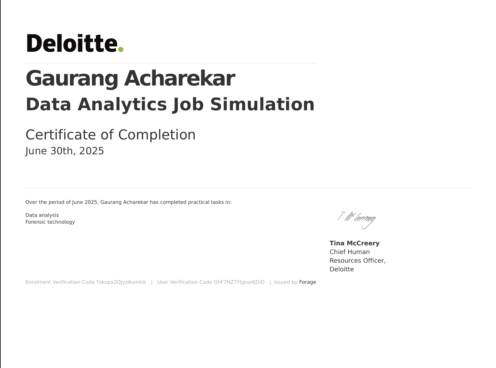
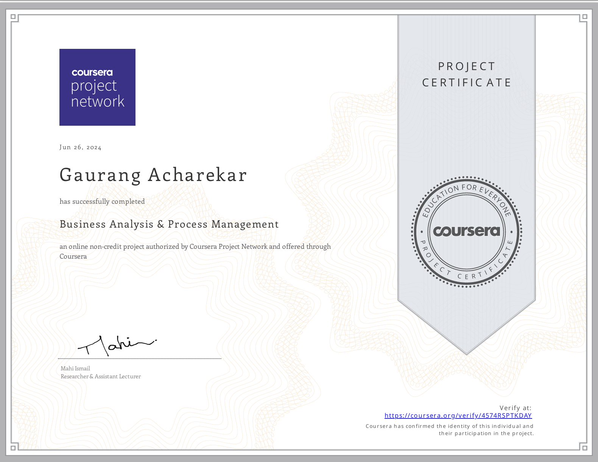
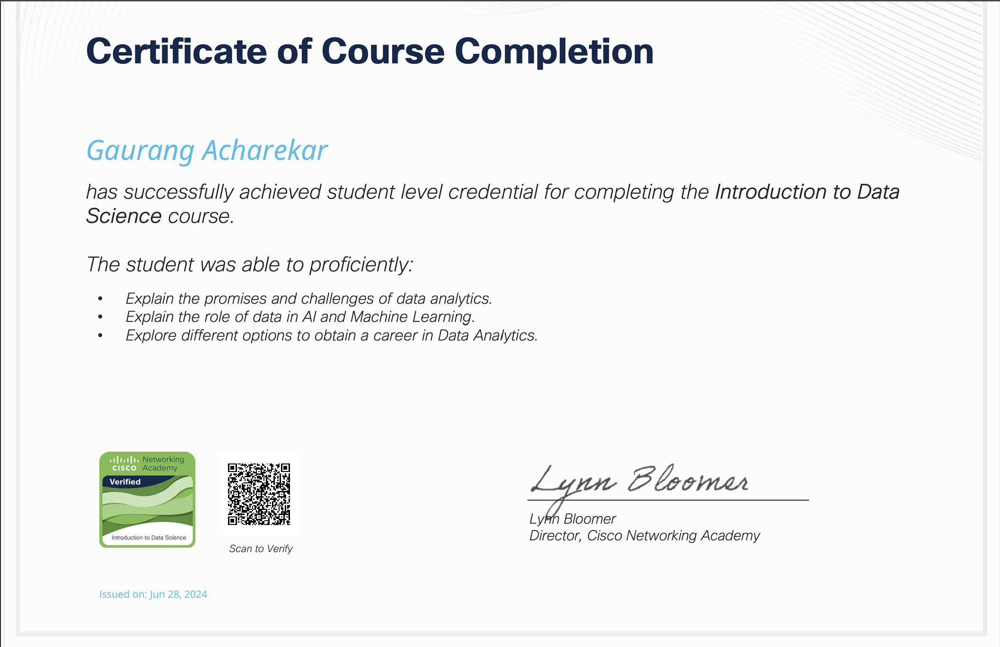

<h1 align="center">Hi 👋, I'm Gaurang Acharekar</h1>
<h3 align="center">A passionate frontend developer from India</h3>

  

- 🌱 I’m currently pursuing **Master's in Data Science from Stony Brook University**  
- 📫 Reach me at **gaurangacharekar10@gmail.com**
- 🌐 Portfolio: **https://v0-portfolio-for-data-analysis.vercel.app/**   
- ⚡ **I love video games :)**

<h3 align="left">Connect with me:</h3>

  
  

 

<!-- ================= CERTIFICATE GRID (3x2) ================= -->

<table align="center">
  <tr>
    <td align="center">
      <a href="Google.pdf" target="_blank">
         
        Google Cloud Associate Cloud Engineer
      </a>
    </td>
    <td align="center">
      <a href="Deloitte.pdf" target="_blank">
         
        Deloitte Data Analytics Simulation
      </a>
    </td>
    <td align="center">
      <a href="Coursera BA and PM.pdf" target="_blank">
         
        Coursera Business Analytics & PM
      </a>
    </td>
  </tr>

  <tr>
    <td align="center">
      <a href="British Airways.pdf" target="_blank">
         
        British Airways Virtual Experience
      </a>
    </td>
    <td align="center">
      <a href="CISCO.pdf" target="_blank">
         
        Cisco Cybersecurity Essentials
      </a>
    </td>
    <td align="center">
      <a href="Microsoft.pdf" target="_blank">
         
        Microsoft AI Fundamentals
      </a>
    </td>
  </tr>
</table>

 

<h3 align="left">Languages and Tools:</h3>

  
  
  
  
  
  
  
  
  
  
  
  
  
  

